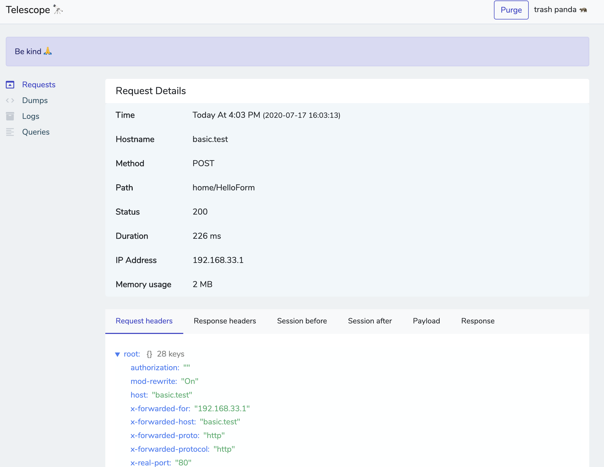
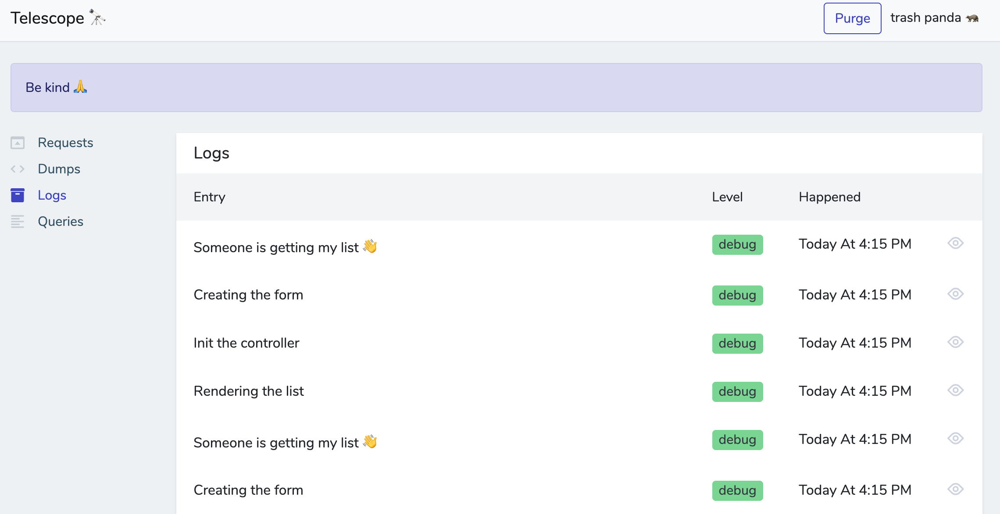
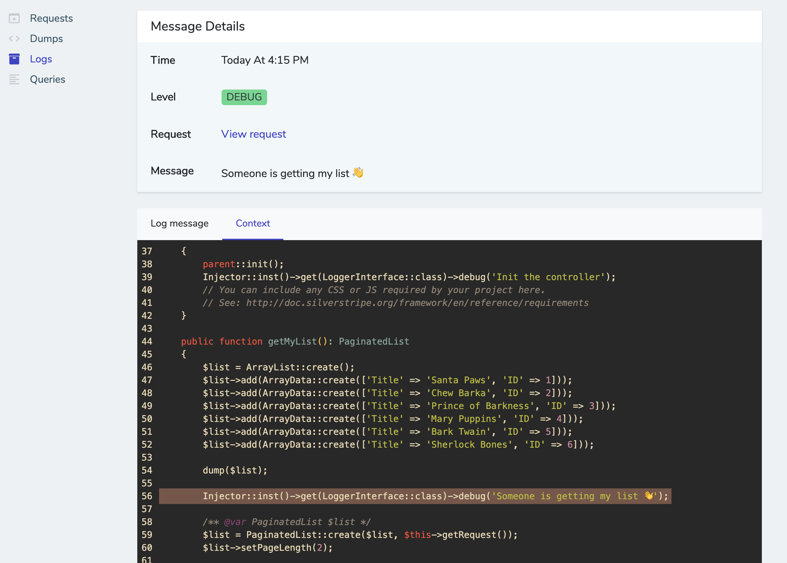

# Telescope
Yeet it into a db

## Requirements

* SilverStripe ^4.0

## Installation
Just chuck it on in mate
```
composer require adrhumphreys/telescope dev-master
```

## Example configuration (optional)
If you have some log wrappers you'll want to exclude those classes from the log handler. Otherwise, the context will always point at your wrapper

```yaml

AdrHumphreys\Telescope\Handlers\LogHandler:
  skipClassesPartials:
    - 'App\Helpers\SystemLog'
```

## Examples:
### Requests



### Logs



